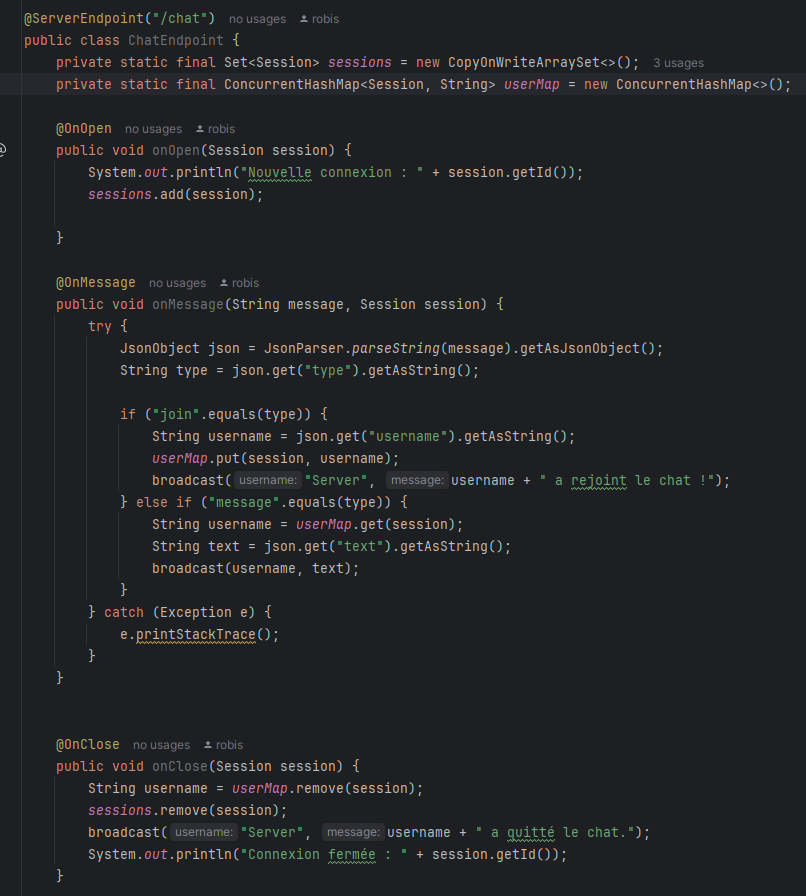
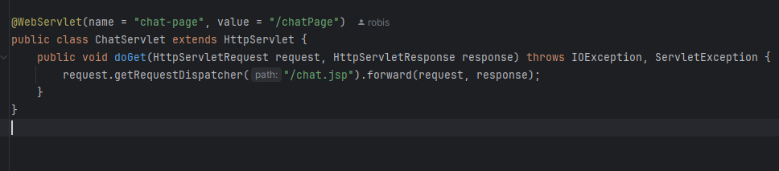
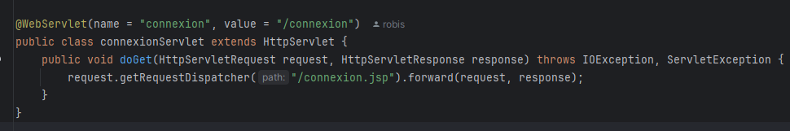
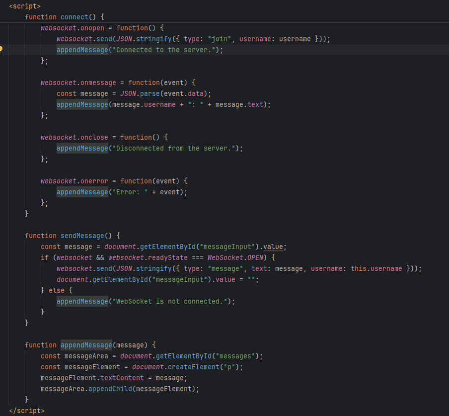
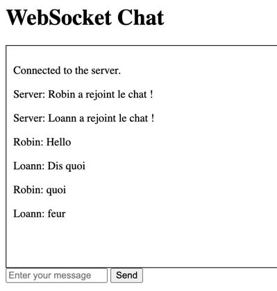
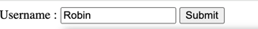
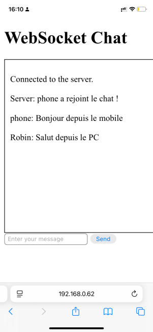

# TP3-J2EE
## Robin Simonneau, Pottier Loann, Landry Simon

## **Exercice 1**

### ***Code et Explication***

Classe ChatEndpoint : Gestion des WebSockets
Cette classe gère les connexions WebSocket pour un système de messagerie en temps réel. Elle est annotée avec @ServerEndpoint, indiquant qu'elle représente un point de communication WebSocket. Elle contient trois méthodes principales :

onOpen : Ajoute une nouvelle connexion à une liste de sessions.
onMessage : Traite les messages entrants (par exemple, l'ajout d'un utilisateur ou la réception d'un message).
onClose : Supprime une session lorsque l'utilisateur se déconnecte.
Explications détaillées :
Set<Session> sessions : Stocke les sessions WebSocket actives pour permettre la diffusion de messages à tous les utilisateurs connectés.
ConcurrentHashMap<Session, String> userMap : Associe chaque session à un nom d'utilisateur pour identifier les participants.
Gestion des événements :
@OnOpen : Ajoute une nouvelle session lorsqu'une connexion WebSocket est ouverte.
@OnMessage : Gère deux types de messages : l'enregistrement d'un utilisateur et les messages texte normaux.
@OnClose : Retire la session et en informe les autres utilisateurs.  

Ce servlet redirige l'utilisateur vers la page JSP dédiée au chat en temps réel. La méthode doGet utilise getRequestDispatcher pour transférer la requête et la réponse HTTP à la ressource chat.jsp. Ce servlet agit comme un contrôleur dans le modèle MVC.

Explications détaillées :
Annotation @WebServlet : Configure l'URL du servlet et son nom. Ici, le servlet est accessible à l'adresse /chatPage.
Redirection : doGet permet d'envoyer l'utilisateur vers la page de chat avec une réponse adaptée.  

Similaire à ChatServlet, ce servlet redirige l'utilisateur vers la page JSP dédiée à la connexion. Il est principalement utilisé pour afficher le formulaire de connexion ou des messages d'erreur spécifiques.

Explications détaillées :
Annotation @WebServlet : Configure l'URL d'accès /connexion.
Redirection vers connexion.jsp : Utilisée pour afficher la page de connexion.  

Ce code gère les interactions entre le client et le serveur WebSocket. Il contient des fonctions pour se connecter, envoyer des messages, et afficher les messages reçus.

Explications détaillées :
connect() : Initialise une connexion WebSocket, gère les événements comme onopen (connexion établie), onmessage (message reçu), et onclose (déconnexion).
sendMessage() : Permet à l'utilisateur d'envoyer un message au serveur WebSocket.
appendMessage() : Ajoute un message reçu à l'interface utilisateur pour l'afficher dans l'historique du chat.  

### *** Resultat ***

Deux utilisateurs, Robin et Loann, participent au chat. Les messages sont bien transmis entre eu  

L'utilisateur peut entrer son nom via une interface simple :  

Bonus:
La connexion entre un téléphone et un ordinateur :   

